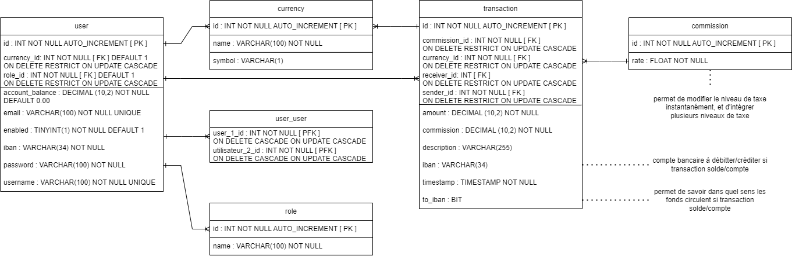

# OC_DA_JAVA_P6

Pay My Buddy est une solution de paiement entre particuliers.

C'est une application web écrite en java, avec une base de données en SQL.
L'application a été construite avec le framework Spring, et en utilisant les modules suivants :
- Spring Security pour l'authentification 
- Thymeleaf pour l'affichage de pages web
- JDBC et JPA pour la communication avec une base de données
***
# SCREENSHOTS

### PROFILE PAGE

### TRANSFER PAGE

***
# DOCUMENTATION
### DIAGRAMME DE CLASSE UML

### ENTITES

### MODELE PHYSIQUE DE DONNEES

